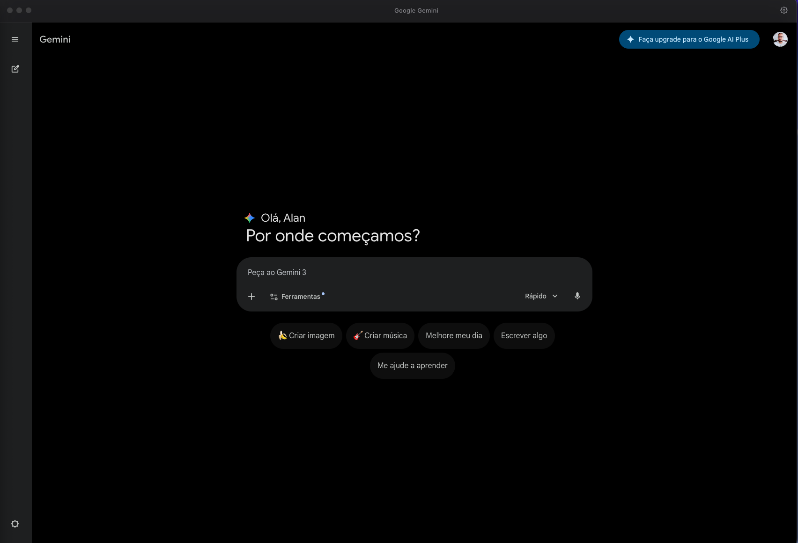

# 💙 Gemini Desktop


[](https://github.com/AlanPrates/Gemini/releases)

Aplicativo desktop multiplataforma que roda o **Google Gemini** como um app nativo no computador — sem precisar abrir o navegador toda hora. Desenvolvido com Electron.



## ✨ Destaques

- ✅ Roda no **Windows**, **macOS** e **Linux**
- ✅ Interface nativa com efeito de vidro (vibrancy) no macOS
- ✅ Estilo Fluent Design no Windows 11
- ✅ Ícone na bandeja do sistema (system tray)
- ✅ Menu nativo integrado
- ✅ Notificações do sistema
- ✅ Atalhos de teclado
- ✅ Painel de configurações

## 🚀 Download

⬇️ **[Baixar última versão](https://github.com/AlanPrates/Gemini/releases/latest)**

| Plataforma | Arquivo |
|---|---|
| Windows | `.exe` |
| macOS | `.dmg` |
| Linux | `.AppImage` |

## 🛠️ Tecnologias

| Tecnologia | Uso |
|---|---|
| Electron | Framework desktop multiplataforma |
| JavaScript | Lógica do app |
| HTML/CSS | Interface do usuário |
| Node.js | Runtime |

## 📂 Estrutura do Projeto

```
Gemini/
└── src/
    ├── main/          # Processo principal (Electron)
    │   ├── index.js     # Ponto de entrada
    │   ├── window.js    # Cria a janela do app
    │   ├── tray.js      # Ícone na bandeja
    │   ├── menu.js      # Menu nativo
    │   └── notifications.js
    ├── renderer/      # Interface visual
    │   ├── index.html
    │   ├── preload.js
    │   └── styles/
    └── shared/        # Compartilhado
        ├── config.js
        └── utils.js
```

## 🚀 Como rodar em desenvolvimento

```bash
# 1. Clone o repositório
git clone https://github.com/AlanPrates/Gemini.git
cd Gemini

# 2. Instale as dependências
npm install

# 3. Rode em modo dev
npm start

# 4. Gerar instalador
npm run build
```

---

<div align="center">
  <a href="https://github.com/AlanPrates">Feito por Alan Prates</a> •
  <a href="https://www.marketplaceprates.com.br">Marketplace Prates</a>
</div>
